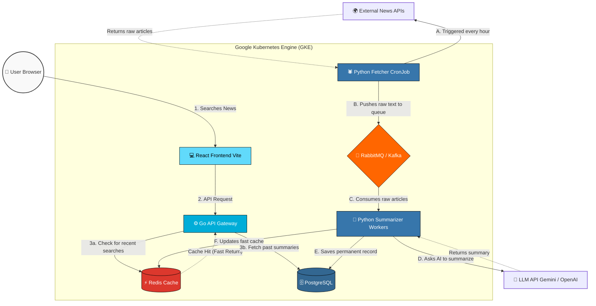

# news-feed-doc
App&amp;Infra documentation

```mermaid
graph TD
    %% Define Styles
    classDef user fill:#f9f9f9,stroke:#333,stroke-width:2px;
    classDef frontend fill:#61dafb,stroke:#000,stroke-width:1px,color:#000;
    classDef backend fill:#00add8,stroke:#000,stroke-width:1px,color:#fff;
    classDef worker fill:#3776ab,stroke:#000,stroke-width:1px,color:#fff;
    classDef db fill:#336791,stroke:#000,stroke-width:1px,color:#fff;
    classDef cache fill:#dc382d,stroke:#000,stroke-width:1px,color:#fff;
    classDef queue fill:#ff6600,stroke:#000,stroke-width:1px,color:#fff;
    classDef external fill:#ececff,stroke:#9370db,stroke-width:2px;

    %% External & Users
    User((👤 User Browser)):::user
    NewsAPI[🌍 External News APIs]:::external
    LLM[🧠 LLM API Gemini / OpenAI]:::external

    subgraph "Google Kubernetes Engine (GKE)"
        %% Frontend
        UI[💻 React Frontend Vite]:::frontend
        
        %% API Gateway
        API[⚙️ Go API Gateway]:::backend
        
        %% Message Broker
        MQ{📨 RabbitMQ / Kafka}:::queue
        
        %% Workers
        Fetcher[🕷️ Python Fetcher CronJob]:::worker
        Summarizer[📝 Python Summarizer Workers]:::worker
        
        %% State / Data
        Cache[(⚡ Redis Cache)]:::cache
        DB[(🗄️ PostgreSQL)]:::db
    end

    %% --- USER FLOW ---
    User -- "1. Searches News" --> UI
    UI -- "2. API Request" --> API
    API -- "3a. Check for recent searches" --> Cache
    Cache -. "Cache Hit (Fast Return)" .-> API
    API -- "3b. Fetch past summaries" --> DB
    
    %% --- BACKGROUND FETCHING FLOW ---
    Fetcher -- "A. Triggered every hour" --> NewsAPI
    NewsAPI -. "Returns raw articles" .-> Fetcher
    Fetcher -- "B. Pushes raw text to queue" --> MQ

    %% --- ASYNC PROCESSING FLOW ---
    MQ -- "C. Consumes raw articles" --> Summarizer
    Summarizer -- "D. Asks AI to summarize" --> LLM
    LLM -. "Returns summary" .-> Summarizer
    Summarizer -- "E. Saves permanent record" --> DB
    Summarizer -- "F. Updates fast cache" --> Cache
```
